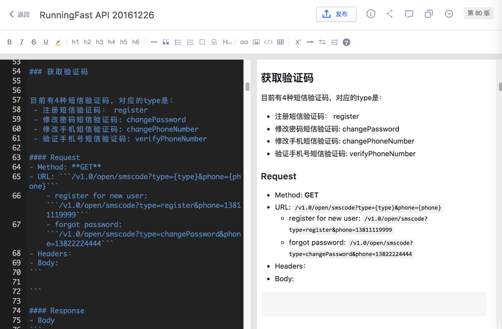
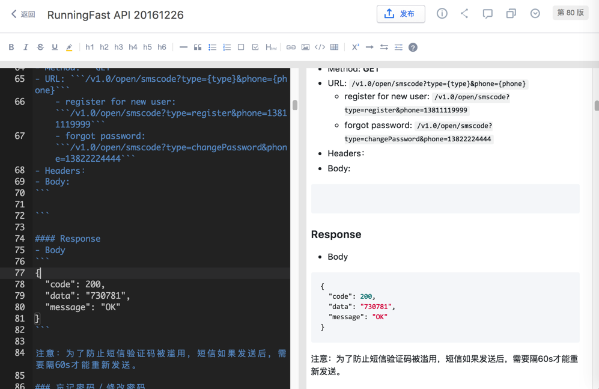
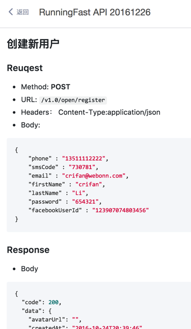
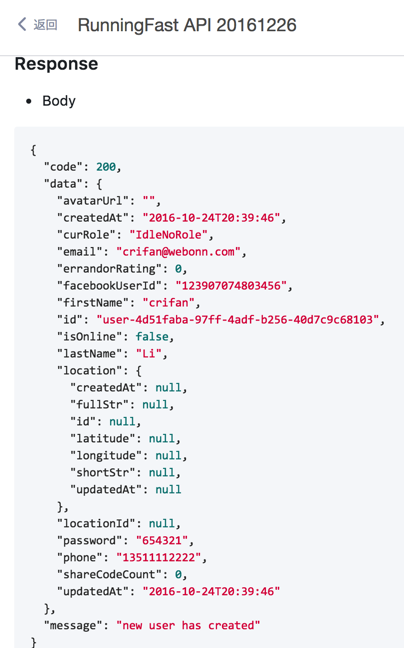
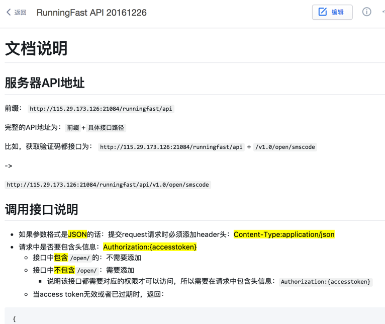
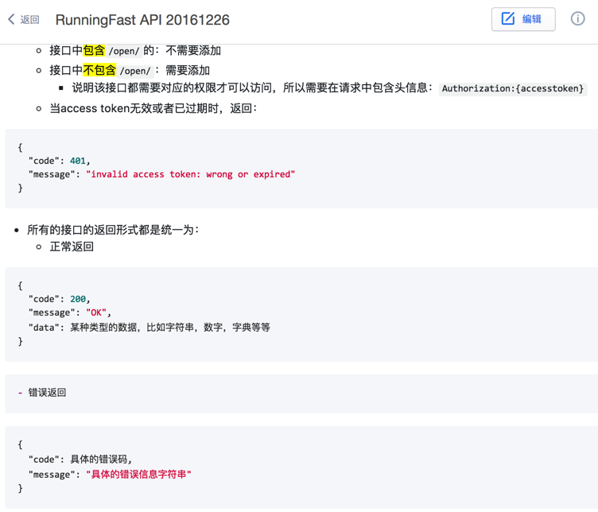

# 用Markdown写API文档
举例：
一个GET方法，用于获取验证码的接口：
在postman中已经调试完毕：


然后去（推荐）有道云笔记中编写markdown：

````markdown
# API接口

## 注册

### 获取验证码

目前有4种短信验证码，对应的type是：
- 注册短信验证码： register
- 修改密码短信验证码: changePassword
- 修改手机短信验证码: changePhoneNumber
- 验证手机号短信验证码: verifyPhoneNumber
#### Request
- Method: **GET**
- URL:  ```/v1.0/open/smscode?type={type}&phone={phone}```
    - register for new user:  ```/v1.0/open/smscode?type=register&phone=13811119999```
    - forgot password: ```/v1.0/open/smscode?type=changePassword&phone=13822224444```
- Headers：
- Body:
```
```

#### Response
- Body
```
{
  "code": 200,
  "data": "730781",
  "message": "OK"
}
```

注意：为了防止短信验证码被滥用，短信如果发送后，需要隔60s才能重新发送。
````

对应的效果：



另外，再举个有request也有response的POST的例子：

````markdown
### 创建新用户
#### Reuqest

- Method: **POST**
- URL: ```/v1.0/open/register```
- Headers： Content-Type:application/json
- Body:
```
{
    "phone" : "13511112222",
    "smsCode" : "730781",
    "email" : "crifan@webonn.com",
    "firstName" : "crifan",
    "lastName" : "Li",
    "password" : "654321",
    "facebookUserId" : "123907074803456"
}
```

#### Response
- Body
```
{
  "code": 200,
  "data": {
    "avatarUrl": "",
    "createdAt": "2016-10-24T20:39:46",
    "curRole": "IdleNoRole",
    "email": "crifan@webonn.com",
    "errandorRating": 0,
    "facebookUserId": "123907074803456",
    "firstName": "crifan",
    "id": "user-4d51faba-97ff-4adf-b256-40d7c9c68103",
    "isOnline": false,
    "lastName": "Li",
    "location": {
      "createdAt": null,
      "fullStr": null,
      "id": null,
      "latitude": null,
      "longitude": null,
      "shortStr": null,
      "updatedAt": null
    },
    "locationId": null,
    "password": "654321",
    "phone": "13511112222",
    "shareCodeCount": 0,
    "updatedAt": "2016-10-24T20:39:46"
  },
  "message": "new user has created"
}
```
````

markdown生成文档的效果：





所以后续其他接口，均可参考上面的GET/POST等接口的写法，去写出对应的markdown的源文件，生成API文档后，效果还是不错的。

当然，也可以用其他Markdown编辑器去写md文件，去生成对应API文档。

另外，再附上，在写具体单个API接口之前的声明的部分：
````markdown
# 文档说明
## 服务器API地址
前缀：
```http://115.29.173.126:21084/runningfast/api```


完整的API地址为：```前缀```+```具体接口路径```

比如，获取验证码都接口为：
```http://115.29.173.126:21084/runningfast/api``` + ```/v1.0/open/smscode```

->

```http://115.29.173.126:21084/runningfast/api/v1.0/open/smscode```

## 调用接口说明
- 如果参数格式是==JSON==的话：提交request请求时必须添加header头：==Content-Type:application/json==
- 请求中是否要包含头信息：==Authorization:{accesstoken}==
    - 接口中==包含==```/open/```的：不需要添加
    - 接口中==不包含==```/open/```：需要添加
        - 说明该接口都需要对应的权限才可以访问，所以需要在请求中包含头信息：```Authorization:{accesstoken}```
    - 当access token无效或者已过期时，返回：
```
{
  "code": 401,
  "message": "invalid access token: wrong or expired"
}
```

- 所有的接口的返回形式都是统一为：
    - 正常返回
```
{
  "code": 200,
  "message": "OK",
  "data": 某种类型的数据，比如字符串，数字，字典等等
}
```
    - 错误返回

```
{
  "code": 具体的错误码,
  "message": "具体的错误信息字符串"
}
```
````
文档效果：




* 优点：简单易上手
* 缺点：后续API更新后，需要及时更新markdown的文档内容

